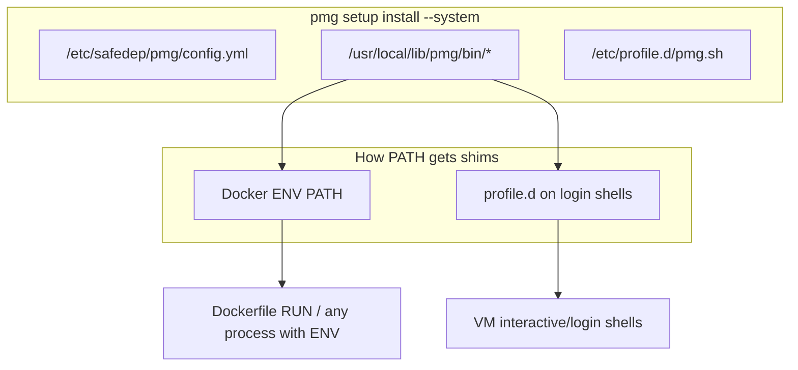

# PMG System Install (`--system`) — Design

Re-evaluation of [issue #317](https://github.com/safedep/pmg/issues/317) against current codebase. Prerequisite [PR #323](https://github.com/safedep/pmg/pull/323) (`PMG_SHIM_PATH`) is already merged.

## Goal

Root can install PMG once for **all users** on a Linux host (golden Docker image, shared VM). Later `USER appuser` / non-root logins get interception without per-user `pmg setup install`.

Primary motivator: package installs inside `docker build` (host GHA PMG cannot see them). Feature itself is a **general Linux system install**, not a Docker mode.

## Non-goals (v1)

- macOS / Windows `--system`
- Persistent proxy baked into images
- In-place wrap of `/usr/local/bin` binaries
- Shell **function** wrappers (venv interactive fix)
- Making host PMG intercept `docker build` from outside the image
- Closing the venv-after-`activate` PATH race via shims

## Locked decisions


| Topic                      | Choice                                                                                       |
| -------------------------- | -------------------------------------------------------------------------------------------- |
| Scope                      | Linux only                                                                                   |
| Shim location              | `/usr/local/lib/pmg/bin` (not `/usr/local/bin`)                                              |
| Config                     | Write `/etc/safedep/pmg/config.yml` (read path already exists)                               |
| PATH on VMs / login shells | `/etc/profile.d/pmg.sh` prepends shim dir                                                    |
| PATH in Docker builds      | Image author sets `ENV PATH="/usr/local/lib/pmg/bin:$PATH"` (documented; required for `RUN`) |
| Venv after `activate`      | Documented limitation → use `pmg pip …`                                                      |
| Proxy-in-image             | Rejected for this use case                                                                   |
| Layers                     | System and per-user installs independent                                                     |


## User flows

### Golden Docker base

```dockerfile
RUN curl -fsSL … | sh && pmg setup install --system
ENV PATH="/usr/local/lib/pmg/bin:$PATH"
```

Child images:

```dockerfile
FROM company/golden:latest
USER appuser
RUN npm ci              # intercepted
RUN pip install pkg     # intercepted (system pip)
# RUN .venv/bin/activate && pip install x  # NOT intercepted — use pmg pip
```

### Multi-user Linux VM

```bash
sudo pmg setup install --system
# new login shells get PATH via /etc/profile.d/pmg.sh
```

### CLI UX

```bash
sudo pmg setup install --system   # root-only; fail fast otherwise
sudo pmg setup remove --system
pmg setup info                    # reports system / user / both
pmg setup doctor                  # checks system shim dir + on PATH
```

- Root without `--system` → warn (other users not covered; point to `--system`), then proceed with per-user install into root’s HOME.
- Non-root `--system` → `usefulerror` + sudo guidance.

## Architecture




### Components to add/change

- `[cmd/setup/setup.go](cmd/setup/setup.go)` — `--system` flag, uid-0 preflight, branch install/remove; root warning without flag
- `[config/config.go](config/config.go)` — `WriteSystemTemplateConfig()` → `globalConfigDir()`; remove only with `--system`
- `[internal/shim/shim.go](internal/shim/shim.go)` — `NewSystemShimManager()` with `BinDir=/usr/local/lib/pmg/bin`, no per-user rc edits
- New system profile writer — `/etc/profile.d/pmg.sh` (marker-gated, PATH prepend only)
- `[cmd/setup/info.go](cmd/setup/info.go)` / `[cmd/setup/doctor.go](cmd/setup/doctor.go)` — system scope reporting + PATH check
- `[main.go](main.go)` / eventlog — soft-fail when log init fails (unusable HOME); do not `Fatalf`

Reuse existing `PMG_SHIM_PATH` filtering in `[internal/shim/path.go](internal/shim/path.go)`; no recursion work needed for the new shim dir.

## Corner cases (handled or documented)


| Case                                                | Handling                                                                                          |
| --------------------------------------------------- | ------------------------------------------------------------------------------------------------- |
| Docker `RUN` does not source profile.d              | Document `ENV PATH=…` in golden image                                                             |
| Login shell resets PATH via `/etc/profile`          | profile.d restores shim dir                                                                       |
| Child Dockerfile overwrites `PATH` without shim dir | Document; doctor can detect when run                                                              |
| Venv `activate` then `pip`                          | Documented limitation → `pmg pip`                                                                 |
| System + per-user both present                      | Independent; remove is scoped                                                                     |
| `PMG_SHIM_PATH` unset + direct `pmg npm`            | Legacy `/.pmg/bin` only; system dir not stripped — prefer shim invocation or ensure env from shim |
| Unwritable HOME                                     | Eventlog soft-fail                                                                                |
| Windows                                             | `--system` → not supported                                                                        |


## Testing

- Unit tests with path overrides (same pattern as `globalConfigDirOverride`)
- Install/remove idempotence for system shims + profile.d
- Doctor/info system detection
- Document a minimal Dockerfile golden-image smoke example in docs (not necessarily CI matrix in v1)

## Docs

- Setup / config docs: `--system`, golden-image snippet, VM vs Docker PATH, venv limitation
- Clarify host GHA PMG does not protect in-image `docker build` installs — bake PMG into the image

## Implementation order (after spec approval)

1. Soft-fail eventlog + root warn (small, unblocks containers)
2. System shim manager + profile.d writer + config write
3. Wire `--system` on install/remove
4. info/doctor
5. Docs + tests

