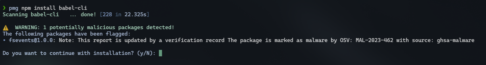
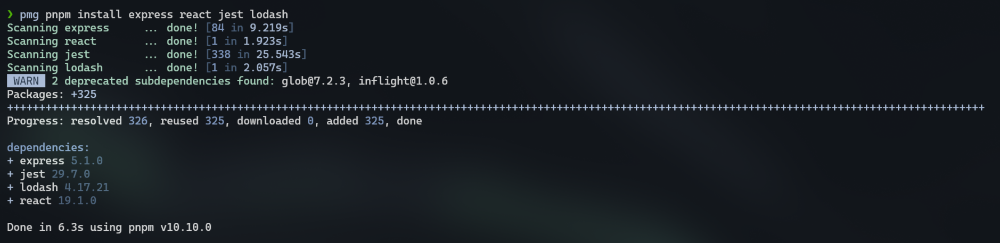

# PMG (Package Manager Guard)
PMG is a wrapper for package managers to protect developers from installing malicious packages.

## TL;DR

Set up `pmg` to protect you development environment:

```
echo "alias npm='pmg npm'" >> ~/.zshrc
echo "alias pnpm='pmg pnpm'" >> ~/.zshrc
source ~/.zshrc
```

Continue using your favorite package manager as usual:

```
npm install <package-name>
pnpm add <package-name>
```

## 📑 Table of Contents
- [PMG (Package Manager Guard)](#pmg-package-manager-guard)
  - [TL;DR](#tldr)
  - [📑 Table of Contents](#-table-of-contents)
  - [Features](#features)
  - [Supported Ecosystems](#supported-ecosystems)
  - [Installation](#installation)
    - [Binaries](#binaries)
    - [Build from Source](#build-from-source)
  - [Usage](#usage)
    - [Silent Mode](#silent-mode)
    - [Verbose Mode](#verbose-mode)
    - [Debugging](#debugging)
    - [PMG in Action](#pmg-in-action)
      - [Malicious Package Detection](#malicious-package-detection)
      - [Bulk Package Analysis](#bulk-package-analysis)
  - [Contributing](#contributing)
  - [Limitations](#limitations)

## Features

- 🚫 Malicious package identification using [SafeDep Cloud](https://docs.safedep.io/cloud/malware-analysis)
- 🌲 Deep dependency analysis and transitive dependency resolution
- ⚡ Fast and efficient package verification
- 🔄 Seamless integration with existing package managers

## Supported Ecosystems

PMG supports the following package ecosystems:

| Ecosystem | Status    | Command                     |
| --------- | --------- | --------------------------- |
| NPM       | ✅ Active  | `pmg npm install <package>` |
| PNPM      | ✅ Active  | `pmg pnpm add <package>`    |
| PyPI      | 🚧 Planned |                             |
| Go        | 🚧 Planned |                             |

> Want us to support your favorite package manager? [Open an issue](https://github.com/safedep/pmg/issues) and let us know!

## Installation

### Binaries

Download the latest binary from the [releases page](https://github.com/safedep/pmg/releases).

### Build from Source

> Ensure $(go env GOPATH)/bin is in your $PATH

```bash
go install github.com/safedep/pmg@latest
```

## Usage

Install a package with `npm` or `pnpm`:

```bash
pmg npm install <package-name>
pmg pnpm add <package-name>
```

Set shell alias for convenience:

```bash
alias npm="pmg npm"
alias pnpm="pmg pnpm"
```

Continue using your favorite package manager as usual:

```bash
npm install <package-name>
```

```bash
pnpm add <package-name>
```

### Silent Mode

Use the `--silent` flag to run PMG in silent mode:

```bash
pmg --silent npm install <package-name>
```

### Verbose Mode

Use the `--verbose` flag to run PMG in verbose mode:

```bash
pmg --verbose npm install <package-name>
```

### Debugging

Use the `--debug` flag to enable debug mode:

```bash
pmg --debug npm install <package-name>
```


### PMG in Action

#### Malicious Package Detection


#### Bulk Package Analysis


## Contributing

Refer to [CONTRIBUTING.md](CONTRIBUTING.md)

## Limitations

<details>
<summary>Approximate dependency version resolution</summary>
`pmg` resolves the transitive dependencies of a package to be installed. It does it by querying
package registry APIs such as `npmjs` and `pypi`. However, almost always, dependency versions are
specified as ranges instead of specific version. Different package managers have different ways of
resolving these ranges. It also depends on peer or host dependencies already available in the application.

`pmg` is required to block a malicious package *before* it is installed. Hence it applies its own heuristic
to choose a version from a version range for evaluation. This is fine when all versions of a given package
is malicious. However, there is a possibility of inconsistency when a specific version of a package is malicious.
</details>
