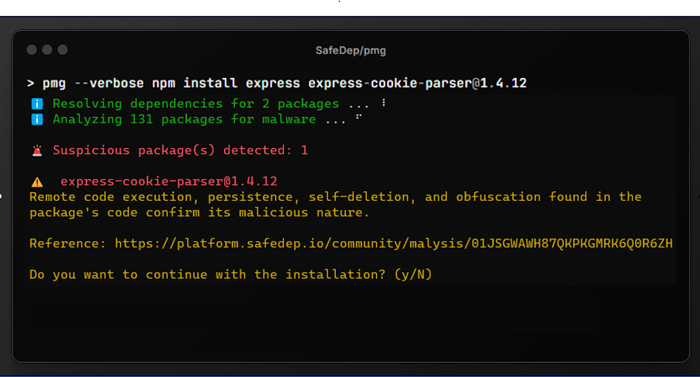

# Package Manager Guard (PMG)

<p>
    Created and maintained by <b><a href="https://safedep.io/">https://safedep.io</a></b> with contributions from the community 🚀
</p>

[](https://goreportcard.com/report/github.com/safedep/pmg)


[](https://api.securityscorecards.dev/projects/github.com/safedep/pmg)
[](https://github.com/safedep/pmg/actions/workflows/codeql.yml)

🤖 PMG protects developers from getting compromised by malicious packages.
See [example](https://safedep.io/malicious-npm-package-express-cookie-parser/)

-   Wraps your favorite package manager (eg. `npm`)
-   Blocks malicious packages at install time
-   No configuration required, just install and use

## 🔥 PMG in Action



## 📦 TL;DR

Install `pmg`

```shell
brew install safedep/tap/pmg
```

Set up `pmg` to protect you development environment from malicious packages:

```
pmg setup install
```

Continue using your favorite package manager as usual:

```shell
npm install <package-name>
```

```shell
uv pip install <package-name>
```

## 📑 Table of Contents

-   [Package Manager Guard (PMG)](#package-manager-guard-pmg)
    -   [🔥 PMG in Action](#-pmg-in-action)
    -   [📦 TL;DR](#-tldr)
    -   [📑 Table of Contents](#-table-of-contents)
    -   [🔥 Features](#-features)
    -   [Supported Package Managers](#supported-package-managers)
    -   [Installation](#installation)
        -   [Homebrew](#homebrew)
        -   [Binaries](#binaries)
        -   [Build from Source](#build-from-source)
    -   [Setup](#setup)
        -   [Install Aliases](#install-aliases)
        -   [Remove Aliases](#remove-aliases)
    -   [Usage](#usage)
        -   [Recommended: Automated Setup](#recommended-automated-setup)
        -   [Alternative: Manual Commands](#alternative-manual-commands)
        -   [Lockfile Installation](#lockfile-installation)
        -   [Silent Mode](#silent-mode)
        -   [Dry Run](#dry-run)
        -   [Verbose Mode](#verbose-mode)
        -   [Debugging](#debugging)
    -   [Environment Variables](#environment-variables)
    -   [🤝 Contributing](#-contributing)
    -   [🚫 Limitations](#-limitations)

## 🔥 Features

-   🚫 Malicious package identification using [SafeDep Cloud](https://docs.safedep.io/cloud/malware-analysis)
-   🌲 Deep dependency analysis and transitive dependency resolution
-   ⚡ Fast and efficient package verification
-   🔄 Seamless integration with existing package managers
-   🔧 Automated shell integration with cross-shell support

## Supported Package Managers

PMG supports the following package managers:

| Package Manager | Status    | Command                                                  |
| --------------- | --------- | -------------------------------------------------------- |
| `npm`           | ✅ Active | `pmg npm install <package>`                              |
| `pnpm`          | ✅ Active | `pmg pnpm add <package>`                                 |
| `bun`           | ✅ Active | `pmg bun add <package>`                                  |
| `yarn`          | ✅ Active | `pmg yarn add <package>`                                 |
| `pip`           | ✅ Active | `pmg pip install <package>`                              |
| `uv`            | ✅ Active | `pmg uv add <package>` or `pmg uv pip install <package>` |
| `poetry`        | ✅ Active | `pmg poetry add <package>`                               |

> Want us to support your favorite package manager? [Open an issue](https://github.com/safedep/pmg/issues) and let us know!

## Installation

### Homebrew

You can install `pmg` using `homebrew` in MacOS and Linux

```bash
brew tap safedep/tap
brew install safedep/tap/pmg
```

### Binaries

Download the latest binary from the [releases page](https://github.com/safedep/pmg/releases).

### Build from Source

> Ensure $(go env GOPATH)/bin is in your $PATH

```bash
go install github.com/safedep/pmg@latest
```

## Setup

PMG provides built-in commands to automatically configure shell aliases for seamless integration:

### Install Aliases

Set up PMG to intercept package manager commands:

```bash
pmg setup install
```

This command will:

-   Create a \~/.pmg.rc file containing package manager aliases
-   Automatically add a source line to your shell configuration files
-   Supports bash, zsh and fish shell

> **Note**: After running `pmg setup install`, restart your terminal or run `source ~/.zshrc` (or your shell's config file) to activate the aliases.

### Remove Aliases

To remove PMG aliases and restore original package manager behavior:

```bash
pmg setup remove
```

This will:

-   Remove the source line from your shell configuration files
-   Delete the ~/.pmg.rc file

> ⚠️ Note: Aliases might still be active in your **current terminal session**. Restart your terminal or use `unalias <cmd>` to remove them instantly.

## Usage

### Recommended: Automated Setup

For the best experience, use the automated setup:

```bash
pmg setup install
```

After setup, use your package managers normally:

```bash
npm install <package-name>
pnpm add <package-name>
bun add <package-name>
yarn add <package-name>

pip install <package-name>

uv add <package-name>
uv pip install <package-name>

poetry add <package-name>
```

### Alternative: Manual Commands

You can also run PMG manually without aliases:

```bash
pmg npm install <package-name>
pmg pnpm add <package-name>
pmg bun add <package-name>
pmg yarn add <package-name>

pmg pip install <package-name>

pmg uv add <package-name>
pmg uv pip install <package-name>

pmg poetry add <package-name>
```

### Lockfile Installation

PMG seamlessly protects lockfile-based installations:

```bash
npm install          # Uses package-lock.json
pnpm install         # Uses pnpm-lock.yaml
bun install          # Uses bun.lock
yarn install         # Uses yarn.lock

pip install -r requirements.txt   # Uses requirements file

uv sync                           # Installs packages from uv.lock
uv pip sync requirements.txt      # Sync from requirements file
uv pip install -r requirements.txt

poetry install      # Installs from poetry.lock
```

PMG scans the exact package versions specified in lockfiles and blocks installation if malicious packages are detected.

### Active Scanning

Use the `--paranoid` flag to perform active malware scanning on unknown packages (requires [SafeDep Cloud credentials](https://docs.safedep.io/cloud/authentication#api-key-authentication)):

```bash
pmg --paranoid npm install <package-name>
```

### Silent Mode

Use the `--silent` flag to run PMG in silent mode:

```bash
pmg --silent npm install <package-name>
```

### Dry Run

Use the `--dry-run` flag to skip actual package installation. When enabled `pmg` will not execute
package manager commands. Useful for checking packages and their transitive dependencies for malware.

```bash
pmg --dry-run npm install <package-name>
```

### Verbose Mode

Use the `--verbose` flag to run PMG in verbose mode:

```bash
pmg --verbose npm install <package-name>
```

### Debugging

Use the `--debug` flag to enable debug mode:

```bash
pmg --debug npm install <package-name>
```

Store the debug logs in a file:

```bash
pmg --debug --log /tmp/debug.json npm install <package-name>
```

## Environment Variables

### PMG_INSECURE_INSTALLATION

Allows bypassing the blocking behavior when malicious packages are detected during installation.

> ⚠️ **Warning**: This is a security feature bypass. Use with extreme caution and only when you understand the risks.

```bash
export PMG_INSECURE_INSTALLATION=true
pmg npm install <package-name>
```

## 🤝 Contributing

Refer to [CONTRIBUTING.md](CONTRIBUTING.md)

## 🚫 Limitations

<details>
<summary>Approximate dependency version resolution</summary>

`pmg` resolves the transitive dependencies of a package to be installed. It does it by querying
package registry APIs such as `npmjs` and `pypi`. However, almost always, dependency versions are
specified as ranges instead of specific version. Different package managers have different ways of
resolving these ranges. It also depends on peer or host dependencies already available in the application.

`pmg` is required to block a malicious package _before_ it is installed. Hence it applies its own heuristic
to choose a version from a version range for evaluation. This is fine when all versions of a given package
is malicious. However, there is a possibility of inconsistency when a specific version of a package is malicious.

</details>

<details>
<summary>PyPI registry scanning only</summary>

`pmg` only scans packages available in the PyPI registry when using any python package manager. Packages installed from
alternative sources such as Git URLs, local file paths, or private registries are not analyzed for
malware detection. This limitation applies to direct installations and transitive dependencies sourced
from non-PyPI locations.

</details>

## Telemetry

`pmg` collects anonymous telemetry to help us understand how it is used and
improve the product. To disable telemetry, set `PMG_DISABLE_TELEMETRY` environment
variable to `true`.

```bash
export PMG_DISABLE_TELEMETRY=true
```
