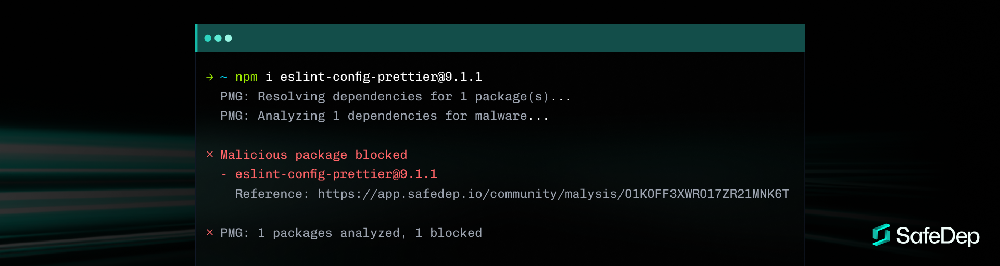

<div align="center">
    
</div>
<br/>

<div align="center">
    <h1>Package Manager Guard (PMG)</h1>
    <h3>Prevent supply chain attacks before they happen.</h3>
</div>

<div align="center">

[](https://docs.safedep.io/pmg/quickstart)
[](https://safedep.io)
[](https://discord.gg/kAGEj25dCn)

[](https://goreportcard.com/report/github.com/safedep/pmg)


[](https://api.securityscorecards.dev/projects/github.com/safedep/pmg)
[](https://github.com/safedep/pmg/actions/workflows/codeql.yml)

</div>

<br>

<div align="center">
  
</div>

## Why PMG?

Modern software development relies heavily on open-source packages. However, standard package managers (`npm`, `pip`, etc.) prioritize convenience over security, executing arbitrary code (like `postinstall` scripts) on your machine without validation. This vector is frequently exploited by attackers to steal credentials or inject backdoors.

**PMG acts as a secure middleware layer.** It wraps your package manager to:

1. **Analyze** packages for malware before they are installed.
2. **Sandbox** the installation process to prevent system modification.
3. **Audit** every package installation event.

## Quick Start

Get protected in seconds.

### 1. Install

**MacOS / Linux (Homebrew)**

```bash
brew install safedep/tap/pmg
```

**NPM**

```bash
npm install -g @safedep/pmg
```

> See [Installation](#installation) for additional methods.

### 2. Setup

Configure your shell to use PMG automatically.

```bash
pmg setup install
# Restart your terminal to apply changes
```

### 3. Use

Continue using your favorite package manager tools as usual. PMG works silently in the background.

```bash
npm install express
# or
pip install requests
```

If a malicious package is detected, PMG blocks it immediately:

```text
[PMG] Blocked malicious package: malicious-lib@1.0.0
[PMG] Reason: Known malware signature detected
```

## Features

| Feature                 | Description                                                                                                                 |
| ----------------------- | --------------------------------------------------------------------------------------------------------------------------- |
| **Malware Blocking**    | Real-time identifcation and blocking of malicious packages using [SafeDep](https://docs.safedep.io/cloud/malware-analysis). |
| **Sandboxing**          | Enforces least privilege using OS-native sandboxing (Seatbelt on macOS) to contain installation scripts.                    |
| **Dependency Analysis** | Deep scans of direct and transitive dependencies before they hit your disk.                                                 |
| **Event Logging**       | Keeps a strictly verifiable audit trail of all installed packages in `~/.pmg/logs`.                                         |
| **Zero Config**         | Works out of the box with sensible security defaults.                                                                       |
| **Cross-Shell**         | Seamlessly integrates with Zsh, Bash, Fish, and more.                                                                       |

## Supported Package Managers

PMG supports the tools you already use:

| Ecosystem   | Tools    | Status | Command Example     |
| ----------- | -------- | ------ | ------------------- |
| **Node.js** | `npm`    | Yes    | `npm install <pkg>` |
|             | `pnpm`   | Yes    | `pnpm add <pkg>`    |
|             | `yarn`   | Yes    | `yarn add <pkg>`    |
|             | `bun`    | Yes    | `bun add <pkg>`     |
|             | `npx`    | Yes    | `npx <pkg>`         |
| **Python**  | `pip`    | Yes    | `pip install <pkg>` |
|             | `poetry` | Yes    | `poetry add <pkg>`  |
|             | `uv`     | Yes    | `uv add <pkg>`      |

## Installation

<details>
<summary><strong>Homebrew (MacOS/Linux)</strong></summary>

```bash
brew tap safedep/tap
brew install safedep/tap/pmg
```

</details>

<details>
<summary><strong>NPM (Cross-Platform)</strong></summary>

```bash
npm install -g @safedep/pmg
```

</details>

<details>
<summary><strong>Go (Build from Source)</strong></summary>

```bash
# Ensure $(go env GOPATH)/bin is in your $PATH
go install github.com/safedep/pmg@latest
```

</details>

<details>
<summary><strong>Binary Download</strong></summary>

Download the latest binary for your platform from the [Releases Page](https://github.com/safedep/pmg/releases).
</details>

## Trust and Security

Security is the first priority. PMG builds are reproducible and signed.

* **Attestations**: GitHub and npm attestations are used to guarantee artifact integrity.
* **Verification**: Users can cryptographically prove the binary matches the source code.
* See [Trusting PMG](docs/trust.md) for verification steps.

## Usage Guide

PMG runs transparently, but you can control it when needed.

### Paranoid Mode

Treat all unverified or suspicious packages as malicious.

```bash
pmg --paranoid npm install <package>
```

### Dry Run

Simulate installation to check for malware without writing to disk.

```bash
pmg --dry-run npm install <package>
```

### Debugging

Enable verbose logs for troubleshooting.

```bash
pmg --debug npm install <package>
```

### Emergency Bypass
>
> ⚠️ **Warning**: Bypassing security checks exposes users to risk.

```bash
export PMG_INSECURE_INSTALLATION=true
npm install <package>
```

## Advanced Documentation

* [Trusted Packages Configuration](docs/trusted-packages.md)
* [Proxy Mode Architecture](docs/proxy-mode.md)
* [Sandboxing Details](docs/sandbox.md)

## Contributing

Contributions are welcome! Please see [CONTRIBUTING.md](CONTRIBUTING.md) for guidelines on how to build and test PMG locally.

## Telemetry

PMG collects anonymous usage data to improve detection capabilities.
To disable: `export PMG_DISABLE_TELEMETRY=true`.
