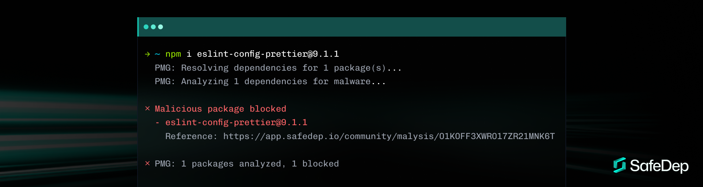
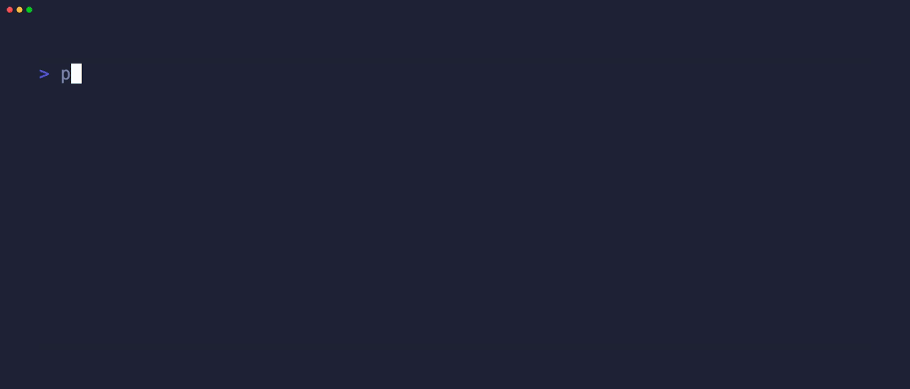

<div align="center">
    
</div>
<br/>

<div align="center">
    <h1>Package Manager Guard (PMG)</h1>
</div>

<div align="center">

[](https://docs.safedep.io/pmg/quickstart)
[](https://safedep.io)
[](https://discord.gg/kAGEj25dCn)

[](https://goreportcard.com/report/github.com/safedep/pmg)


[](https://api.securityscorecards.dev/projects/github.com/safedep/pmg)
[](https://github.com/safedep/pmg/actions/workflows/codeql.yml)

</div>

<br>

<div align="center">
  
</div>

## Why PMG?

AI coding agents install packages you didn't choose. Claude Code, Cursor, Copilot, Windsurf all run `npm install` and `pip install` autonomously, and you have no idea what they just put on your machine.

PMG ensures every package is checked for malware before it executes, whether you picked it or an AI agent did.

1. **Analyze** packages for malware before they are installed.
2. **Sandbox** the installation process to prevent system modification.
3. **Audit** every package installation event.

Install PMG once, and every `npm install`, `pip install`, and `poetry add` is protected automatically.

> Featured in [tl;dr sec](https://tldrsec.com/p/tldr-sec-316) and used by engineering teams worldwide to secure their software supply chain.

## How PMG is Different

Most security tools scan after installation and report vulnerabilities. By then, malicious code has already executed on your machine.

PMG intercepts package managers **before** code executes, blocking malicious packages at install time, not flagging them after the damage is done. Detection is powered by [SafeDep's malicious package analysis engine](https://safedep.io). For defense in depth, PMG sandboxes the installation process using OS-native isolation, so even zero-day malware that evades detection cannot modify your system.

## Quick Start

Get protected in seconds.

### 1. Install

**MacOS / Linux (Homebrew)**

```bash
brew install safedep/tap/pmg
```

**NPM**

```bash
npm install -g @safedep/pmg
```

> See [Installation](#installation) for additional methods.

### 2. Setup

Configure your shell to use PMG automatically.

```bash
pmg setup install
# Restart your terminal to apply changes
```

### 3. Use

Use your package managers as usual — or let your AI coding agent use them. PMG works silently in the background.

```bash
npm install express
# or
pip install requests
```

When an AI agent (or you) tries to install a malicious package, PMG blocks it:

```text
✗ Malicious package blocked

  - safedep-test-pkg@1.0.0

✗ PMG: 1 packages analyzed, 1 blocked
```

## Features

| Feature                          | Description                                                                                                      |
| -------------------------------- | ---------------------------------------------------------------------------------------------------------------- |
| **AI Agent Safety Net**          | Protects against malicious packages installed by AI coding agents (Claude Code, Cursor, Copilot, Windsurf).      |
| **Malicious Package Protection** | Real-time protection against malicious packages using [SafeDep](https://docs.safedep.io/cloud/malware-analysis). |
| **Sandboxing**                   | Enforces least privilege using OS native sandboxing to contain installation scripts.                             |
| **Dependency Analysis**          | Deep scans of direct and transitive dependencies before they hit your disk.                                      |
| **Event Logging**                | Keeps a verifiable audit trail of all installed packages.                                                        |
| **Zero Config**                  | Works out of the box with sensible security defaults.                                                            |
| **Cross-Shell**                  | Seamlessly integrates with Zsh, Bash, Fish, and more.                                                            |

## Supported Package Managers

PMG supports the tools you already use:

| Ecosystem   | Tools    | Status | Command Example     |
| ----------- | -------- | ------ | ------------------- |
| **Node.js** | `npm`    | Yes    | `npm install <pkg>` |
|             | `pnpm`   | Yes    | `pnpm add <pkg>`    |
|             | `yarn`   | Yes    | `yarn add <pkg>`    |
|             | `bun`    | Yes    | `bun add <pkg>`     |
|             | `npx`    | Yes    | `npx <pkg>`         |
|             | `pnpx`   | Yes    | `pnpx <pkg>`        |
| **Python**  | `pip`    | Yes    | `pip install <pkg>` |
|             | `poetry` | Yes    | `poetry add <pkg>`  |
|             | `uv`     | Yes    | `uv add <pkg>`      |

## Installation

<details>
<summary><strong>Homebrew (MacOS/Linux)</strong></summary>

```bash
brew tap safedep/tap
brew install safedep/tap/pmg
```

</details>

<details>
<summary><strong>NPM (Cross-Platform)</strong></summary>

```bash
npm install -g @safedep/pmg
```

</details>

<details>
<summary><strong>Go (Build from Source)</strong></summary>

```bash
# Ensure $(go env GOPATH)/bin is in your $PATH
go install github.com/safedep/pmg@latest
```

</details>

<details>
<summary><strong>Binary Download</strong></summary>

Download the latest binary for your platform from the [Releases Page](https://github.com/safedep/pmg/releases).
</details>

## Trust and Security

Security is our first class requirement. PMG builds are reproducible and signed.

* **Attestations**: GitHub and npm attestations are used to guarantee artifact integrity.
* **Verification**: Users can cryptographically prove the binary matches the source code.
* See [Trusting PMG](docs/trust.md) for verification steps.

## User Guide

* [Trusted Packages Configuration](docs/trusted-packages.md)
* [Proxy Mode Architecture](docs/proxy-mode.md)
* [Sandboxing Details](docs/sandbox.md)

## Support

If PMG saved you from a bad package, [star this repo](https://github.com/safedep/pmg) — it helps others find it.

## Contributing

Contributions are welcome! Please see [CONTRIBUTING.md](CONTRIBUTING.md) for guidelines on how to build and test PMG locally.

## Telemetry

PMG collects anonymous usage data to improve project stability and reliability.
To disable: `export PMG_DISABLE_TELEMETRY=true`.
