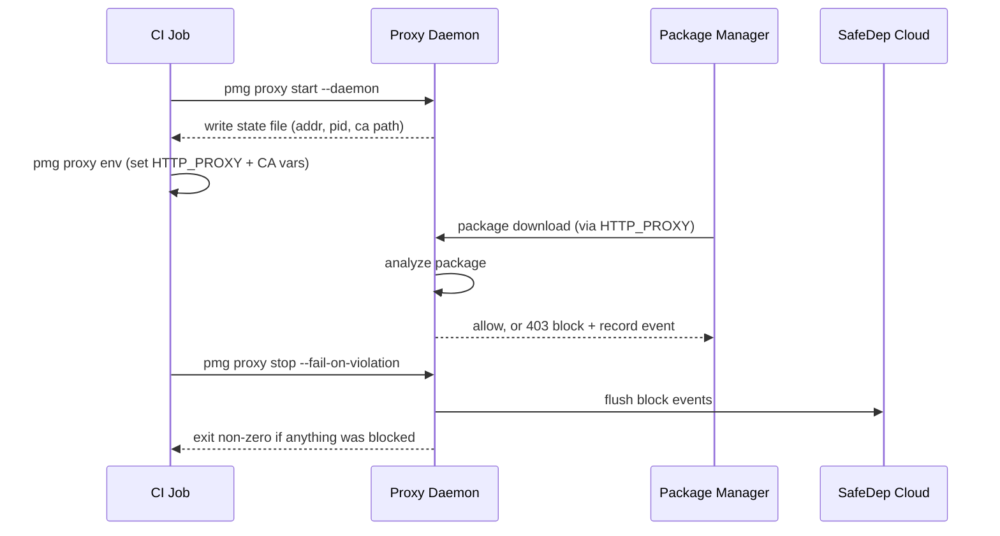

# Persistent Proxy Server

The persistent proxy server runs PMG's MITM proxy as a long-lived process that
intercepts **every** supported package manager invocation in an environment via
standard proxy environment variables, without shims, aliases, or wrapping each
command with `pmg`. It is built for non-interactive environments, primarily
CI/CD pipelines (e.g. GitHub Actions), where the environment can be configured
once for the whole job.

It builds on the generic MITM proxy described in [proxy.md](./proxy.md), reusing
the same interceptor chain, malware analyzer, and certificate manager. The
difference is the **lifecycle**. Instead of PMG starting an ephemeral proxy
around a single subprocess, the proxy is started once, advertises itself through
a state file, and serves many package manager processes until it is stopped.

## Default proxy mode vs. persistent proxy server

PMG's default proxy mode (see [proxy.md](./proxy.md)) wraps a single command.
`pmg npm install` starts an ephemeral proxy, runs `npm` as a child with proxy
env vars injected, then tears the proxy down. The persistent server decouples
these steps.

| | Default proxy mode | Persistent proxy server |
| --- | --- | --- |
| Invocation | `pmg npm install` (wrapped) | bare `npm install` (no wrapper) |
| Proxy lifetime | One subprocess | Until `pmg proxy stop` |
| Who runs the PM | PMG (as a child) | The user / CI directly |
| Ecosystems served | The one being run | All supported (npm + PyPI) |
| Confirmation on malware | Interactive prompt (TTY) | Auto-block (non-interactive) |
| Reporting | At subprocess exit | At `pmg proxy stop` |
| Target | Local dev | CI/CD pipelines |

## How it works

The diagram below shows the order of events in a CI job. Each `pmg proxy`
command talks to the daemon only through the state file, so the steps stay
independent and can run in separate workflow steps.



## Architecture

The code is split into two layers, mirroring the rest of PMG's `cmd/*` to
`internal/*` structure.

- **`cmd/proxy/`** is thin Cobra command wrappers (`start`, `stop`, `env`,
  `status`). They bind flags and render output only, holding no business logic.
- **`internal/proxyserver/`** holds all lifecycle and analysis logic: the
  foreground server loop (`Run`), daemonization (`Daemonize`), shutdown
  (`Stop`), env-var construction (`EnvVars`), status (`GetStatus`), the on-disk
  `State`, the analyzer and cache wiring, and the cloud flush.

The proxy itself is the same `proxy.ProxyServer` from [proxy.md](./proxy.md).
The persistent server adds a state file for cross-process coordination, a daemon
mode, an auto-block confirmation handler, audit-pipeline initialization, and a
synchronous cloud flush on shutdown.

## Lifecycle

A typical CI run has four steps.

1. **Start.** `pmg proxy start --daemon` resolves a free loopback port, sets up
   the CA, builds the interceptors for every supported ecosystem, starts the
   proxy server, and writes the state file. With `--daemon` it detaches and
   returns immediately; otherwise it runs in the foreground and blocks.
2. **Configure env.** `pmg proxy env` reads the state file and prints the proxy
   environment variables. In CI these are appended to the job environment so all
   subsequent steps inherit them.
3. **Install.** Bare `npm install`, `pip install`, etc. route through the proxy
   via `HTTP_PROXY`/`HTTPS_PROXY`. Each downloaded package is analyzed.
   Malicious packages are auto-blocked (the client receives a `403` and fails)
   and a durable audit event is recorded.
4. **Stop.** `pmg proxy stop` signals the daemon, waits for it to drain
   in-flight requests and write the final blocked count, flushes audit events to
   the cloud, and removes the state file. With `--fail-on-violation` it exits
   non-zero if any package was blocked.

## Commands

```bash
pmg proxy start [--daemon|-D] [--state PATH] [--port N]
pmg proxy stop  [--fail-on-violation] [--state PATH]
pmg proxy env   [--state PATH]
pmg proxy status [--state PATH]
```

- **`start`** starts the server. `--daemon`/`-D` detaches into a background
  process (Unix only); without it the server runs in the foreground. `--port`
  binds a fixed port (default: random). The bind host is `127.0.0.1` by default
  and configurable via `proxy.server.listen_host` (see [Bind address](#bind-address)).
  It refuses to start if a live proxy is already recorded in the state file.
- **`stop`** signals the running proxy, drains it, flushes events to the cloud,
  and removes the state file. `--fail-on-violation` makes the command exit
  non-zero when one or more packages were blocked (see
  [Fail on violation](#fail-on-violation)).
- **`env`** prints proxy environment variables as `KEY=VALUE` lines. See
  [Usage](#usage) for how to consume them.
- **`status`** reports whether a proxy is running, stopped (stale state), or not
  present.

`--state` is shared by all subcommands and overrides the state file location.

## Bind address

The proxy binds `127.0.0.1` by default, so it is reachable only from the host
(the right choice for CI and local use). The host is configurable via
`proxy.server.listen_host` (or the `PMG_PROXY_SERVER_LISTEN_HOST` environment
variable); `--port` selects the port. The effective address is
`<listen_host>:<port>`.

Set `listen_host` to `0.0.0.0` or a specific interface **only** for a
deliberately hosted deployment. A non-loopback bind exposes the MITM proxy to
the network: any client routed through it has its HTTPS intercepted and must
trust the PMG CA. Keep it loopback unless you are intentionally running a shared
proxy service.

## State file

The state file is how separate `pmg` invocations discover the running daemon. It
is the only shared state between the `start` process and the `stop`, `env`, and
`status` processes.

- **Location:** `<cache-dir>/proxy-state.json` by default, overridable with
  `--state`. The cache directory follows `PMG_CACHE_DIR` or the OS cache dir
  (`~/.cache/safedep/pmg` on Linux). Parent directories are created on write.
- **Contents:**

  ```json
  {
    "pid": 12345,
    "addr": "127.0.0.1:54321",
    "ca_cert_path": "/home/user/.config/safedep/pmg/proxy-ca.pem",
    "blocked_count": 0
  }
  ```

| Field | Used by |
| --- | --- |
| `pid` | `stop` (SIGTERM), `status` (liveness via signal 0) |
| `addr` | `env` (builds `HTTP_PROXY=http://<addr>`) |
| `ca_cert_path` | `env` (cert trust vars) |
| `blocked_count` | written after drain on shutdown; read by `stop` |

The daemon also writes a log to `<cache-dir>/proxy.log` when run with `--daemon`.

## Certificate trust

The proxy performs TLS MITM, so clients must trust its CA. On start the proxy
sets up the CA (`SetupCACertificate`): it reuses the persisted CA from
`pmg setup cert install` if present, otherwise generates an ephemeral one, and
writes it merged with the system bundle to `<config-dir>/proxy-ca.pem`.

### Trust comes from environment variables, not the OS trust store

`pmg proxy env` always emits the cert-path variables pointing at that bundle:
`NODE_EXTRA_CA_CERTS`, `SSL_CERT_FILE`, `REQUESTS_CA_BUNDLE`, `PIP_CERT`,
`YARN_HTTPS_CA_FILE_PATH`. Package managers pick these up from the job
environment and trust the proxy's CA, with no OS trust-store install required.

This is deliberate: whether a tool consults the OS trust store varies by tool,
version, and config (npm/Node ignore it by default; modern pip can read it;
`requests`/`certifi` ship their own bundle). The cert-path vars work across all
of them, and are harmlessly ignored by tools that do read the OS store. They are
always emitted, never skipped based on OS-trust status, so a tool on a bundled
CA store is never silently left untrusted.

### Why `pmg setup cert install` is not needed here

Because trust is env-var based, the persistent proxy does not require the CA in
the OS trust store. In particular, on Linux `pmg setup cert install` (without
`--system`) is a no-op for trust: Linux has no per-user trust store, so it only
persists the keypair. The proxy works regardless: with no persisted CA it just
generates an ephemeral one, and `pmg proxy env` carries the trust.

OS trust-store install (`pmg setup cert install --system`) is intentionally
not used. It is a poor default because it:

- needs root, so it breaks on container jobs and locked-down self-hosted
  runners where the env-var approach works fine;
- persistently installs a MITM-capable CA into the machine trust store, which
  lingers after the run on non-ephemeral (self-hosted) runners;
- does not even remove the need for the env vars, since npm/Node ignore the OS
  store by default and still require `NODE_EXTRA_CA_CERTS`.

It only pays off for tools that ignore the cert env vars, or for a future
network-level enforcement model where env vars don't apply (see Limitations).
When that's needed it belongs behind an explicit opt-in, not the default.

Loopback addresses are always excluded from proxying via `NO_PROXY`
(`localhost,127.0.0.1,::1`).

## Cloud event sync

When SafeDep Cloud is enabled, malware-block events must reach the cloud even on
ephemeral CI runners that are destroyed immediately after the job. The
persistent server handles this in two layers.

1. **Durable, as it happens.** The daemon initializes the audit pipeline on
   start, so the existing interceptors record each blocked package to the audit
   event log immediately. Events survive a crash.
2. **Synchronous flush on stop.** `pmg proxy stop` performs a blocking cloud
   sync (acquiring the shared sync lock, bounded by a timeout) before returning.
   This guarantees events are delivered before the runner is torn down, rather
   than relying on the interval-based background sync used for long-lived
   workstations. A flush failure is logged but does not mask the
   fail-on-violation exit code.

## Fail on violation

By default `pmg proxy stop` just stops the proxy and exits `0`. Failing the CI
job on a policy violation is opt-in via `--fail-on-violation`.

- It exits non-zero when `blocked_count > 0`.
- It **fails closed**. If the daemon shut down without writing a verifiable
  final state (e.g. it crashed), `--fail-on-violation` also fails, because a
  security gate must not pass on an unverifiable run.

The package manager's own non-zero exit (from the `403` on a blocked download)
is a separate signal. `--fail-on-violation` gives an authoritative gate from the
proxy regardless of how the package manager reported the failure.

## Daemonization

`--daemon` re-execs the PMG binary as a foreground server detached into its own
session (`setsid`), with the child's stdio redirected to
`<cache-dir>/proxy.log`. The parent polls the state file until the child is
ready, prints the address, and exits. The re-exec passes an internal flag so the
child runs the server directly and does not recurse into daemonization.

Daemonization is **Unix only**. On Windows, `--daemon` returns a clear
"not supported" error; the foreground `pmg proxy start` still works.

## Usage

The persistent server targets non-interactive CI/CD. For local development use
the default proxy mode (`pmg npm install`), which keeps the interactive malware
confirmation prompt; the persistent server auto-blocks without prompting.

GitHub Actions (raw commands):

```yaml
- run: pmg proxy start --daemon
- run: pmg proxy env >> "$GITHUB_ENV"
- run: npm ci
- run: pmg proxy stop --fail-on-violation
  if: always()
```

GitHub Actions (via the [safedep/pmg action](../action.yml) `server-mode`):

```yaml
- uses: safedep/pmg@v1
  with:
    server-mode: true
    api-key: ${{ secrets.SAFEDEP_API_KEY }}
    tenant-id: ${{ secrets.SAFEDEP_TENANT_ID }}

- run: npm ci          # intercepted automatically

- name: Enforce PMG policy
  if: always()
  run: pmg proxy stop --fail-on-violation
```

In `server-mode`, the action starts the daemon and injects env vars instead of
installing shims. Because composite actions cannot run an automatic cleanup
step, the final `pmg proxy stop --fail-on-violation` step is required. It stops
the proxy, flushes events to the cloud, and fails the job on a block.

## Security model

- **Loopback by default.** The proxy binds `127.0.0.1` unless
  `proxy.server.listen_host` is changed, so by default it is not exposed to the
  network. Binding a non-loopback address (for a hosted deployment) is a
  deliberate choice that exposes the MITM proxy; see [Bind address](#bind-address).
- **Auto-block, fail-closed.** Suspicious packages are denied without an
  interactive prompt (appropriate for non-interactive CI), and the optional gate
  fails closed on an unverifiable shutdown.
- **File permissions.** The state file, daemon log, and CA bundle are written
  with `0600`/`0700`.
- **No self-proxy loop.** The daemon starts before any proxy env vars are
  injected into the job, so the daemon's own analyzer and cloud calls go direct,
  and `NO_PROXY` covers loopback.

## Limitations

- **Unix-only daemon.** `--daemon` is not supported on Windows (foreground mode
  works).
- **Non-interactive only.** There is no interactive confirmation; flagged
  packages are always auto-blocked. This is intentional for CI.
- **Single proxy per state file.** Starting a second proxy that points at the
  same state file is refused while one is running.
- **System-level trust enforcement is out of scope.** The server relies on env
  var propagation. Enforcing interception for `sudo`-scrubbed environments (e.g.
  via `iptables`) and system-wide install (`pmg setup install --system`) are
  tracked separately.

## References

- [proxy.md](./proxy.md) is the underlying generic MITM proxy server
- [config.md](./config.md) is the configuration schema (cloud, proxy, cache dir)
- [action.yml](../action.yml) is the PMG GitHub Action (`server-mode`)
