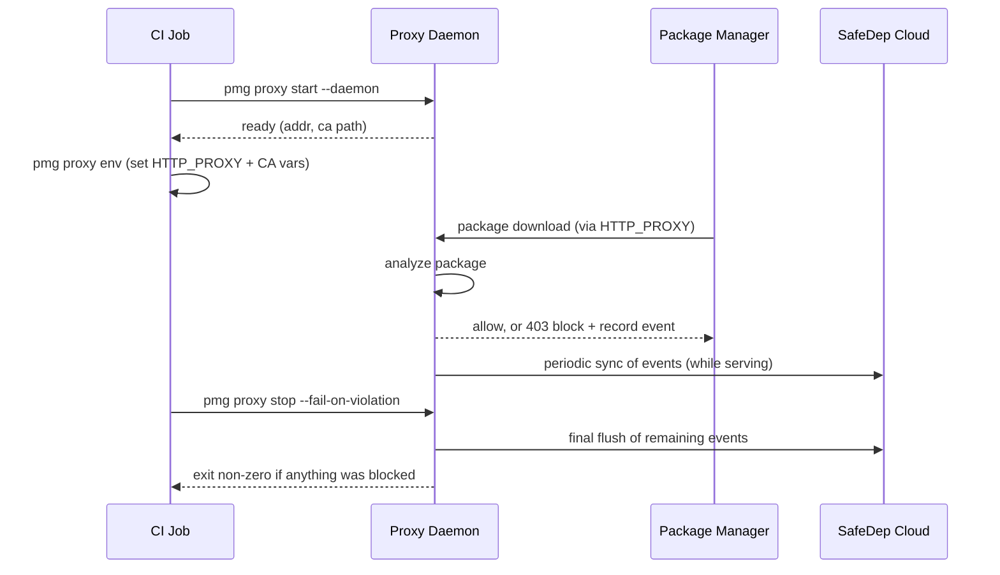

# Persistent Proxy Server

The persistent proxy server runs PMG's MITM proxy as a long-lived process that
intercepts **every** supported package manager invocation in an environment via
standard proxy environment variables, without shims, aliases, or wrapping each
command with `pmg`. It is built for non-interactive environments, primarily
CI/CD pipelines (e.g. GitHub Actions), where the environment can be configured
once for the whole job.

It builds on the generic MITM proxy described in [proxy.md](./proxy.md), reusing
the same interceptor chain, malware analyzer, and certificate manager. The
difference is the **lifecycle**: instead of PMG starting an ephemeral proxy
around a single subprocess, the proxy is started once, advertises itself to the
other `pmg proxy` commands, and serves many package manager processes until it
is stopped.

## Default proxy mode vs. persistent proxy server

PMG's default proxy mode (see [proxy.md](./proxy.md)) wraps a single command.
`pmg npm install` starts an ephemeral proxy, runs `npm` as a child with proxy
env vars injected, then tears the proxy down. The persistent server decouples
these steps.

| | Default proxy mode | Persistent proxy server |
| --- | --- | --- |
| Invocation | `pmg npm install` (wrapped) | bare `npm install` (no wrapper) |
| Proxy lifetime | One subprocess | Until `pmg proxy stop` |
| Who runs the PM | PMG (as a child) | The user / CI directly |
| Ecosystems served | The one being run | All supported (npm + PyPI) |
| Confirmation on malware | Interactive prompt (TTY) | Auto-block (non-interactive) |
| Reporting | At subprocess exit | At `pmg proxy stop` |
| Target | Local dev | CI/CD pipelines |

## How it works

The diagram below shows the order of events in a CI job. The `pmg proxy`
commands run in separate workflow steps and coordinate through the running
daemon.


```mermaid
sequenceDiagram
    participant CI as CI Job
    participant Proxy as Proxy Daemon
    participant PM as Package Manager
    participant Cloud as SafeDep Cloud

    CI->>Proxy: pmg proxy start --daemon
    Proxy-->>CI: ready (addr, ca path)
    CI->>CI: pmg proxy env  (set HTTP_PROXY + CA vars)
    PM->>Proxy: package download (via HTTP_PROXY)
    Proxy->>Proxy: analyze package
    Proxy-->>PM: allow, or 403 block + record event
    Proxy->>Cloud: periodic sync of events (while serving)
    CI->>Proxy: pmg proxy stop --fail-on-violation
    Proxy->>Cloud: final flush of remaining events
    Proxy-->>CI: exit non-zero if anything was blocked
```

## Usage

The persistent server targets non-interactive CI/CD. For local development use
the default proxy mode (`pmg npm install`), which keeps the interactive malware
confirmation prompt. The persistent server auto-blocks without prompting.

GitHub Actions (raw commands):

```yaml
- run: pmg proxy start --daemon
- run: pmg proxy env >> "$GITHUB_ENV"
- run: npm ci
- run: pmg proxy stop --fail-on-violation
  if: always()
```

GitHub Actions (via the [safedep/pmg action](../action.yml) `server-mode`):

```yaml
- uses: safedep/pmg@v1
  with:
    server-mode: true
    api-key: ${{ secrets.SAFEDEP_API_KEY }}
    tenant-id: ${{ secrets.SAFEDEP_TENANT_ID }}

- run: npm ci          # intercepted automatically

- name: Enforce PMG policy
  if: always()
  run: pmg proxy stop --fail-on-violation
```

In `server-mode`, the action starts the daemon and injects env vars instead of
installing shims. Because composite actions cannot run an automatic cleanup
step, the final `pmg proxy stop --fail-on-violation` step is required. It stops
the proxy (the daemon flushes events to the cloud during shutdown) and fails the
job on a block.

## Commands

```bash
pmg proxy start    # start the proxy (foreground, or detached with --daemon)
pmg proxy stop     # stop the proxy and report the outcome
pmg proxy env      # print env vars that route package managers through it
pmg proxy status   # report whether a proxy is running
```

Run `pmg proxy <command> --help` for flags. `--daemon` is **Unix only**: on
Windows it returns a clear "not supported" error, and the foreground
`pmg proxy start` still works. To run multiple independent proxies on one host,
give each a distinct `--state` path and `--port`.

## Bind address

The proxy binds `127.0.0.1` on a random port by default, reachable only from the
host (the right choice for CI and local use). Override with `--host`/`--port`, or
the `proxy.server.listen_host`/`listen_port` config (flags take precedence).

Bind a non-loopback address (e.g. `--host 0.0.0.0`) **only** for a deliberately
hosted deployment: it exposes the MITM proxy to the network, and every client
routed through it has its HTTPS intercepted and must trust the PMG CA.

## Custom registries

The daemon loads `proxy.registries` once, at startup, from the same config
file the default proxy mode reads. See [Custom Registries](./proxy-mode.md#custom-registries)
for the configuration reference.

The daemon does not notice a config file edit. Restart it after you add,
remove, or edit a registry entry:

```bash
pmg proxy stop
pmg proxy start --daemon
```

The default proxy mode does not have this limitation. `pmg npm install`
starts a fresh proxy process for each command, so it always reads the
current config file.

## Certificate trust

The proxy performs TLS MITM, so clients must trust its CA. Trust is delivered
through **environment variables, not the OS trust store**. `pmg proxy env`
always emits the cert-path variables pointing at the proxy's CA bundle:
`NODE_EXTRA_CA_CERTS`, `SSL_CERT_FILE`, `REQUESTS_CA_BUNDLE`, `PIP_CERT`,
`YARN_HTTPS_CA_FILE_PATH`. Package managers pick these up from the job
environment and trust the proxy's CA, with no OS trust-store install required.

This is deliberate: whether a tool consults the OS trust store varies by tool,
version, and config (npm/Node ignore it by default; modern pip can read it;
`requests`/`certifi` ship their own bundle). The cert-path vars work across all
of them, and are harmlessly ignored by tools that do read the OS store.

As a result `pmg setup cert install` is **not** needed for the persistent proxy.
If a persisted CA from `pmg setup cert install` exists the proxy reuses it,
otherwise it generates an ephemeral one. Either way `pmg proxy env` carries the
trust. OS trust-store install (`pmg setup cert install --system`) is
intentionally not used: it needs root (breaking container and locked-down
runners), persistently installs a MITM-capable CA into the machine trust store,
and still does not remove the need for the env vars.

[Kernel enforcement](#kernel-enforcement-linux) is the exception. It runs as
root in any case and uses the system trust store instead of the variables.

Loopback addresses are always excluded from proxying via `NO_PROXY`
(`localhost,127.0.0.1,::1`).

## Kernel enforcement (Linux)

Environment variables are a request. A process decides whether it honors
them. Node ignores `HTTP_PROXY` unless `NODE_USE_ENV_PROXY=1` is set, `env -i`
and `sudo` drop the variables, and an install script with its own HTTP client
never reads them. `pmg proxy start --enforce` closes that gap on Linux. The
kernel routes every TCP connection to ports 80 and 443 from every eligible
process to the proxy. A process cannot opt out.

```bash
sudo pmg setup cert install --system
sudo pmg proxy start --daemon --enforce --state "$RUNNER_TEMP/pmg-proxy-state.json"
sudo pmg proxy env --state "$RUNNER_TEMP/pmg-proxy-state.json" >> "$GITHUB_ENV"
# ... job steps ...
sudo pmg proxy stop --state "$RUNNER_TEMP/pmg-proxy-state.json" --fail-on-violation
```

The [safedep/pmg action](../action.yml) does this with `server-mode: true`
and `enforce: true`. See [github-action.md](./github-action.md).

### How it works

The daemon attaches BPF programs to the cgroup v2 root through `bpf_link`.
The `connect` hooks rewrite the destination of an eligible connection to the
proxy's loopback listener and record the original destination. The proxy
sniffs each redirected connection: TLS to a registry host is terminated with
the PMG CA, every other host is passed through with its real certificate,
and plain HTTP is served as a proxy request. UDP to an enforced port gets
`EPERM`, so a QUIC client falls back to TCP. When the daemon exits, for any
reason, the kernel detaches the programs. There is nothing to clean up after
a crash. A crash therefore fails open: until the daemon runs again, nothing
routes through PMG. A supervisor that restarts it closes that window, as
`Restart=on-failure` does in the [example unit](../examples/systemd/pmg-proxy.service).

One daemon enforces a cgroup. A second `pmg proxy start --enforce` on the
same cgroup fails with `EnforceAlreadyActive`, because the kernel would
accept a second set of programs that never sees a connection. The daemon
holds a lock on the cgroup directory while it is attached, so two daemons
that start at the same moment cannot both pass the check.

The daemon attaches before it reports ready. There is no window in which the
proxy runs and a connection is not enforced.

### Eligibility

Every process is eligible unless the policy says otherwise. The daemon's own
pid is the only process exempt by pid. The `pmg` binary is not exempt: the
per-command proxy of `pmg npm install` chains into the daemon, so
`PMG_INSECURE_INSTALLATION=true pmg npm install` cannot bypass it.

The policy lives in `proxy.server.enforce`:

```yaml
proxy:
  server:
    listen_port: 7777
    enforce:
      enabled: true
      ports: [80, 443]
      eligible_users: []
      exempt_users: []
      exempt_executables:
        - /home/runner/actions-runner/bin/Runner.*
      skip_destinations: [10.20.0.0/16]
      cgroup: ""
      deny_udp: true
```

- `ports` are the destination ports to route. The ports of `proxy.registries`
  endpoints are always added.
- `exempt_executables` are absolute paths or globs. A CI runner agent belongs
  here, because its traffic to the CI service must not depend on the proxy.
  On GitHub Actions the action finds `Runner.Worker` among its ancestors and
  exempts `<runner dir>/Runner.*` itself. When a listed binary appears or
  changes after the daemon starts, the daemon picks up the new file. Never
  exempt an interpreter (`node`, `python3`, `sh`) or a general HTTP client
  (`curl`, `wget`). An install script can run any of them.
- `eligible_users` narrows enforcement to some users. It is safe only when no
  eligible user can become another one. `sudo curl` runs as root, and root is
  then not eligible. Leave it empty on a runner whose user has `sudo`. The
  daemon warns when an eligible user is in the `sudo` or `wheel` group.
- `skip_destinations` adds to the built-in skip list: loopback, link-local
  (cloud instance metadata) and the Azure host address `168.63.129.16`.
- `cgroup` narrows the scope to one cgroup v2 directory. The default, the
  root, covers every process on the host, including a runner that `systemd`
  started in its own slice.

### Which config file the daemon reads

A root daemon reads the managed config, `/etc/safedep/pmg/config.yml`, when
it exists, and root's own per-user file otherwise. It never reads the file
of the user who ran `sudo`. `pmg proxy status` and the start message name
the file the daemon loaded, and a start that fell back to root's per-user
file warns. `sudo pmg config edit --system` and `sudo pmg config set --system
<key> <value>` change the managed config, and `pmg config path` shows which
file a command reads. See [config.md](./config.md#which-file-a-command-reads).

### Policy from the command line

Every policy key has a flag on `pmg proxy start` and a `PMG_*` variable:

| Config key | Flag | Variable |
| --- | --- | --- |
| `ports` | `--enforce-port` (repeatable) | `PMG_PROXY_SERVER_ENFORCE_PORTS` |
| `eligible_users` | `--enforce-eligible-user` (repeatable) | `PMG_PROXY_SERVER_ENFORCE_ELIGIBLE_USERS` |
| `exempt_users` | `--enforce-exempt-user` (repeatable) | `PMG_PROXY_SERVER_ENFORCE_EXEMPT_USERS` |
| `exempt_executables` | `--enforce-exempt-executable` (repeatable) | `PMG_PROXY_SERVER_ENFORCE_EXEMPT_EXECUTABLES` |
| `skip_destinations` | `--enforce-skip-destination` (repeatable) | `PMG_PROXY_SERVER_ENFORCE_SKIP_DESTINATIONS` |
| `cgroup` | `--enforce-cgroup` | `PMG_PROXY_SERVER_ENFORCE_CGROUP` |
| `deny_udp` | `--enforce-deny-udp` | `PMG_PROXY_SERVER_ENFORCE_DENY_UDP` |

A list flag adds to the list in the file and never replaces it, so a flag
cannot drop a skip destination or an exempt user an administrator set. A
list variable, comma-separated, replaces the list, as every `PMG_*` variable
does. `--enforce-cgroup` and `--enforce-deny-udp` override the file.

```bash
sudo pmg proxy start --daemon --enforce \
  --enforce-exempt-executable '/opt/agent/bin/agent' \
  --enforce-skip-destination 10.20.0.0/16
```

The parent checks the flags before it detaches, so an unknown user or a
bad prefix is reported at once. Under `global_lockdown` the flags that
loosen the policy fail fast: `--enforce-eligible-user`,
`--enforce-exempt-user`, `--enforce-exempt-executable`,
`--enforce-skip-destination` and `--enforce-deny-udp=false`. A port or a
cgroup only narrows or moves the scope and stays allowed.

### Trust

eBPF cannot set a process's environment, so enforcement does not deliver
trust. It uses one mechanism: the system trust store. `sudo pmg setup cert
install --system` writes the keypair to `/etc/safedep/pmg/`, root-owned with
a `0600` key, and installs the certificate into the store. `pmg proxy start
--enforce` refuses to start when the CA is not in the store, and it never
generates an ephemeral CA.

Trust only decides whether a tool works. It never decides whether a
connection bypasses the proxy. A client that does not trust the CA fails the
TLS handshake on a registry host and gets nothing. Non-registry hosts keep
their real certificate, so enforcement adds no trust requirement for
`github.com` or `apt`.

In enforce mode `pmg proxy env` prints no proxy variables and no CA path. It
prints the variables that point a tool at the system store:

| Variable | Why |
| --- | --- |
| `NODE_USE_SYSTEM_CA=1` | Node, and with it npm, pnpm, yarn and aube, ignores the store without it. Node 20 has no switch and is not supported. |
| `UV_NATIVE_TLS=1` | uv validates against its bundled roots without it. |
| `REQUESTS_CA_BUNDLE=<system bundle>` | Tools built on Python `requests` validate against `certifi`. poetry needs it. pip does not. |

`curl`, Go, pip and bun trust the store on their own.

### Requirements

- Linux 5.15 or later with kernel BTF (`CONFIG_DEBUG_INFO_BTF`) and cgroup v2.
  GitHub hosted runners meet this.
- `CAP_BPF`, `CAP_NET_ADMIN` and `CAP_PERFMON`, so root in practice. The
  daemon runs as root. Every `pmg proxy` lifecycle command then runs under
  `sudo` with an explicit `--state` path, because `sudo` resets `HOME`.
- The PMG CA in the system trust store, through `sudo pmg setup cert install
  --system`.

`pmg setup doctor` reports whether the host can enforce. `pmg proxy start
--enforce` fails before it binds a port when a requirement is missing, and
the error names it. On macOS and Windows it fails with an error that names
the platform.

### Self-hosted runners

A `systemd` unit can start the enforcing proxy at boot, with a fixed
`listen_port`. See [examples/systemd/pmg-proxy.service](../examples/systemd/pmg-proxy.service).
The runner's `.env` file carries the trust variables. The operator runs
`pmg setup cert install --system` once as root. On a self-hosted runner the
runner cannot stop a root daemon at job end, so the daemon serves later jobs
until an operator stops it. `pmg proxy status` shows that it is still
enforcing.

### Known gap: containers

Enforcement covers the host network namespace only. A process in another
network namespace passes unchanged, because the kernel would otherwise send
it to its own loopback. On GitHub Actions this leaves three paths outside
enforcement: `RUN` steps in `docker build`, container jobs
(`jobs.<id>.container`) and Docker container actions. Image pulls are still
enforced, because `dockerd` runs on the host, and the proxy passes image
registries through. The daemon prints a warning when Docker is running, and
`pmg proxy status` repeats it.

The workaround puts the install step in the host network namespace and gives
it trust in the PMG CA, with the CA as a build secret so it never lands in
the image:

```bash
docker build --network=host --secret id=pmg-ca,src=/etc/safedep/pmg/ca-cert.pem .
```

```dockerfile
RUN --mount=type=secret,id=pmg-ca,target=/run/pmg-ca.pem NODE_EXTRA_CA_CERTS=/run/pmg-ca.pem npm ci
```

A `docker run` step takes `--network host` and the same mount. Container
jobs and Docker actions have no workaround, because GitHub does not accept
`--network` in `container.options`. Trust must add to the container's
existing trust. A bundle that holds only the PMG CA breaks the non-registry
hosts the proxy passes through. `NODE_EXTRA_CA_CERTS` adds. For tools that
replace the bundle (`SSL_CERT_FILE`, `REQUESTS_CA_BUNDLE`, `PIP_CERT`),
mount the host bundle, which holds the PMG CA after `pmg setup cert install
--system`.

### Limitations

- A process of the same user can reuse an exempt binary. A job step runs as
  the same user as `Runner.Worker`, and it can hard-link that binary next to
  its own code and run under the exempt inode. This needs deliberate,
  runner-specific work. It is not something a package manager does by
  accident. The sandbox owns that threat.
- `eligible_users` is bypassed by `sudo`. See above.
- The proxy decides by name. A redirected TLS connection without SNI, or
  with Encrypted ClientHello, and a plain HTTP request without a `Host`
  header are dropped, because an IP never matches a registry and would pass
  one without analysis. A registry that clients reach by IP literal needs a
  name, or a `skip_destinations` entry so the kernel never redirects it.
- A passed-through TLS connection is dialed by its server name, not by the
  address the client resolved. A client cannot steer the root daemon to an
  address through a false name, and the proxy resolves the name once more.
- A client that pins certificates fails closed on registry hosts. Same as
  today.
- The daemon runs as root. A privilege drop after attach is a follow-up.

## Cloud event sync

When SafeDep Cloud is enabled, malware-block events must reach the cloud even on
ephemeral CI runners that are destroyed immediately after the job. The daemon
owns delivery: it records each blocked package to a durable local event log as
it happens, syncs pending events to SafeDep Cloud periodically while serving, and
flushes whatever remains on shutdown.

`pmg proxy stop` reports the recorded result (`Synced N event(s) to SafeDep
Cloud`, or a `Cloud sync failed` line). A flush failure is surfaced but does not
mask the fail-on-violation exit code.

## Fail on violation

By default `pmg proxy stop` just stops the proxy and exits `0`. Failing the CI
job on a policy violation is opt-in via `--fail-on-violation`.

- It exits non-zero when any package was blocked.
- It **fails closed**. If the daemon shut down without writing a verifiable
  final state (e.g. it crashed), `--fail-on-violation` also fails, because a
  security gate must not pass on an unverifiable run.

The package manager's own non-zero exit (from the `403` on a blocked download)
is a separate signal. `--fail-on-violation` gives an authoritative gate from the
proxy regardless of how the package manager reported the failure.

## Limitations

- **Unix-only daemon.** `--daemon` is not supported on Windows (foreground mode
  works).
- **Non-interactive only.** There is no interactive confirmation; flagged
  packages are always auto-blocked. This is intentional for CI.
- **Single proxy per state file.** Starting a second proxy that points at the
  same state file is refused while one is running.
- **Environment-based routing is best effort.** Without `--enforce` the
  server relies on env var propagation, and a process that drops or ignores
  the variables bypasses it. Use [kernel enforcement](#kernel-enforcement-linux)
  on Linux. For system-wide shell shims on Linux, see
  [system-install.md](./system-install.md).

## References

- [proxy.md](./proxy.md) is the underlying generic MITM proxy server
- [config.md](./config.md) is the configuration schema (cloud, proxy, cache dir)
- [action.yml](../action.yml) is the PMG GitHub Action (`server-mode`)
