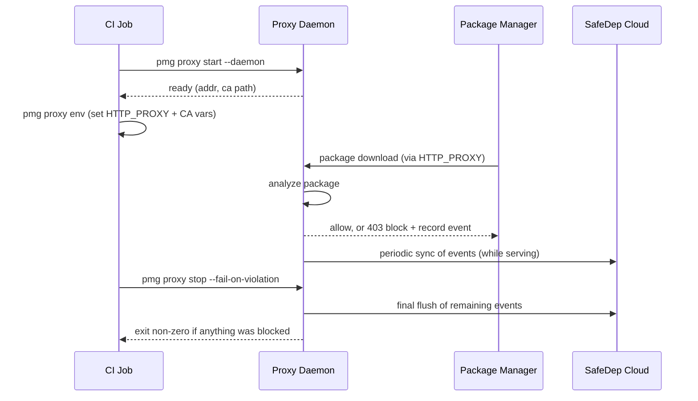

# Persistent Proxy Server

The persistent proxy server runs the PMG proxy as one long-lived process.
Every supported package manager in the environment goes through it, with no
shim, alias or `pmg` wrapper. It is made for CI jobs, where you set up the
environment once and then run many commands.

It uses the same interceptors, malware analyzer and certificate manager as
the proxy in [proxy.md](./proxy.md). The difference is the lifecycle. You
start the proxy once, the other `pmg proxy` commands find it, and it serves
every package manager until you stop it.

## Default proxy mode vs. persistent proxy server

`pmg npm install` starts a proxy, runs `npm` as a child with the proxy
variables set, and stops the proxy. The persistent server separates these
steps.

| | Default proxy mode | Persistent proxy server |
| --- | --- | --- |
| Command | `pmg npm install` | `npm install` |
| Proxy lifetime | One command | Until `pmg proxy stop` |
| Who runs the package manager | PMG | You, or the CI job |
| Ecosystems | The one you run | All supported |
| Malware found | Interactive prompt | Block, no prompt |
| Report | When the command exits | At `pmg proxy stop` |
| Made for | Local development | CI jobs |

## How it works


```mermaid
sequenceDiagram
    participant CI as CI Job
    participant Proxy as Proxy Daemon
    participant PM as Package Manager
    participant Cloud as SafeDep Cloud

    CI->>Proxy: pmg proxy start --daemon
    Proxy-->>CI: ready (addr, ca path)
    CI->>CI: pmg proxy env  (set HTTP_PROXY + CA vars)
    PM->>Proxy: package download (via HTTP_PROXY)
    Proxy->>Proxy: analyze package
    Proxy-->>PM: allow, or 403 block + record event
    Proxy->>Cloud: periodic sync of events (while serving)
    CI->>Proxy: pmg proxy stop --fail-on-violation
    Proxy->>Cloud: final flush of remaining events
    Proxy-->>CI: exit non-zero if anything was blocked
```

The `pmg proxy` commands run in separate workflow steps. They find each
other through a state file that the daemon writes.

## Usage

Use the persistent server in CI. For local development use `pmg npm
install`, which keeps the interactive prompt. The server blocks without a
prompt.

GitHub Actions with raw commands:

```yaml
- run: pmg proxy start --daemon
- run: pmg proxy env >> "$GITHUB_ENV"
- run: npm ci
- run: pmg proxy stop --fail-on-violation
  if: always()
```

GitHub Actions with the [safedep/pmg action](../action.yml), described in
[github-action.md](./github-action.md):

```yaml
- uses: safedep/pmg@v1
  with:
    server-mode: true
    api-key: ${{ secrets.SAFEDEP_API_KEY }}
    tenant-id: ${{ secrets.SAFEDEP_TENANT_ID }}

- run: npm ci          # intercepted automatically

- name: Enforce PMG policy
  if: always()
  run: pmg proxy stop --fail-on-violation
```

With `server-mode` the action starts the daemon and sets the variables for
the job. A composite action cannot run a cleanup step, so the last step is
yours. It stops the proxy, flushes events to the cloud, and fails the job
when a package was blocked.

## Commands

```bash
pmg proxy start    # start the proxy, in the foreground or detached with --daemon
pmg proxy stop     # stop the proxy and report the outcome
pmg proxy env      # print the variables that route package managers through it
pmg proxy status   # report whether a proxy runs
```

`pmg proxy <command> --help` lists the flags. `--daemon` works on Unix only.
On Windows use the foreground `pmg proxy start`. To run more than one proxy
on a host, give each its own `--state` path and `--port`.

## Bind address

The proxy binds `127.0.0.1` on a random port. Only the host reaches it,
which is right for CI and local use. `--host` and `--port` change this, and
so do `proxy.server.listen_host` and `listen_port` in the config. A flag has
priority over the config.

Bind another address, such as `0.0.0.0`, only for a deployment you host on
purpose. It exposes the proxy to the network, and every client you route
through it must trust the PMG CA.

With a wildcard bind such as `0.0.0.0`, `pmg proxy env` exports
`127.0.0.1` on the same port, because a client cannot connect to a wildcard
address. A client on another machine must use the address of this machine.

## Custom registries

The daemon reads `proxy.registries` once, at start, from the same config
file the default proxy mode reads. See
[Custom Registries](./proxy-mode.md#custom-registries).

The daemon does not see a later edit. Restart it after you change a
registry:

```bash
pmg proxy stop
pmg proxy start --daemon
```

`pmg npm install` starts a new proxy for each command, so it always reads
the current file.

## Certificate trust

The proxy terminates TLS, so a client must trust its CA. `pmg proxy env`
prints the variables that point each tool at the CA bundle:
`NODE_EXTRA_CA_CERTS`, `SSL_CERT_FILE`, `REQUESTS_CA_BUNDLE`, `PIP_CERT` and
`YARN_HTTPS_CA_FILE_PATH`. You do not install the CA into the OS trust
store. `NO_PROXY` always excludes `localhost`, `127.0.0.1` and `::1`.

The variables exist because tools do not agree on the OS store. Node ignores
it by default, modern pip reads it, and `requests` ships its own bundle. The
variables work for all of them.

You do not run `pmg setup cert install`. The proxy reuses that CA when it
exists and makes one for this run when it does not. `pmg setup cert install
--system` needs root and puts a CA that can intercept into the machine
store, so the persistent proxy does not use it. [Kernel
enforcement](#kernel-enforcement-linux) is the exception. It runs as root
and uses the system store.

## Kernel enforcement (Linux)

A variable is a request. A process can ignore it. Node needs
`NODE_USE_ENV_PROXY=1` to read `HTTP_PROXY`, `env -i` and `sudo` drop the
variables, and an install script with its own HTTP client never reads them.
`pmg proxy start --enforce` removes that gap on Linux. The kernel sends every
TCP connection to ports 80 and 443 from every eligible process to the proxy.
A process cannot opt out.

```bash
sudo pmg setup cert install --system
sudo pmg proxy start --daemon --enforce --state "$RUNNER_TEMP/pmg-proxy-state.json"
sudo pmg proxy env --state "$RUNNER_TEMP/pmg-proxy-state.json" >> "$GITHUB_ENV"
# ... job steps ...
sudo pmg proxy stop --state "$RUNNER_TEMP/pmg-proxy-state.json" --fail-on-violation
```

The [safedep/pmg action](../action.yml) does this with `server-mode: true`
and `enforce: true`. See [github-action.md](./github-action.md).

### How it works

The daemon attaches BPF programs to the cgroup v2 root. The `connect` hooks
rewrite the destination of an eligible connection to the proxy's loopback
listener and record the original destination. The proxy looks at the first
bytes of each redirected connection. TLS to a registry host is terminated
with the PMG CA. Every other host is passed through with its real
certificate. Plain HTTP is served as a proxy request. UDP to an enforced port
gets `EPERM`, so a QUIC client falls back to TCP. The kernel also records
which process opened each connection, and the
[Host Observation event](./proxy-mode.md#how-pmg-matches-a-request) names it.

When the daemon exits, for any reason, the kernel detaches the programs.
Nothing is left to clean up after a crash. Until the daemon runs again,
connections go out directly. A supervisor that restarts it, such as
`Restart=on-failure` in the
[example unit](../examples/systemd/pmg-proxy.service), keeps that time
short.

One daemon enforces a cgroup. A second `pmg proxy start --enforce` on the
same cgroup fails with `EnforceAlreadyActive`. The daemon locks the cgroup
directory while it is attached, so two daemons that start at the same
moment cannot both pass the check. It attaches before it reports ready, so
every connection made after the start is enforced.

### Eligibility

Every process is eligible unless the policy says otherwise. Only the daemon's
own pid is exempt by pid. The `pmg` binary is not exempt, so
`PMG_INSECURE_INSTALLATION=true pmg npm install` cannot bypass the daemon.

The policy lives in `proxy.server.enforce`:

```yaml
proxy:
  server:
    listen_port: 7777
    enforce:
      enabled: true
      ports: [80, 443]
      eligible_users: []
      exempt_users: []
      exempt_executables:
        - /home/runner/actions-runner/bin/Runner.*
      skip_destinations: [10.20.0.0/16]
      cgroup: ""
      deny_udp: true
```

- `ports` are the destination ports to route. The ports of
  `proxy.registries` endpoints are always added.
- `exempt_executables` are absolute paths or globs of programs that connect
  directly. A CI runner agent belongs here. On GitHub Actions the action
  finds `Runner.Worker` among its ancestors and exempts `<runner dir>/Runner.*`
  itself. The daemon applies the list to a binary that appears or changes
  later. Never exempt an interpreter such as `node`, `python3` or `sh`, or an
  HTTP client such as `curl` or `wget`. An install script can run any of them.
- `eligible_users` limits enforcement to some users. It is safe only when no
  eligible user can become another one. `sudo curl` runs as root, and root is
  then not eligible. Leave it empty on a runner whose user has `sudo`. The
  daemon warns when an eligible user is in the `sudo` or `wheel` group.
- `skip_destinations` adds to the built-in skip list: loopback, link-local
  (cloud instance metadata) and the Azure host address `168.63.129.16`.
- `cgroup` limits the scope to one cgroup v2 directory. The default is the
  root, which covers every process on the host.

### Which config file the daemon reads

A root daemon reads the managed config, `/etc/safedep/pmg/config.yml`, when
it exists, and root's own per-user file otherwise. It never reads the file
of the user who ran `sudo`. The start message and `pmg proxy status` name
the file, and a start that used root's per-user file warns. Change the
managed config with `sudo pmg config edit --system` or `sudo pmg config set
--system <key> <value>`. See
[config.md](./config.md#which-file-a-command-reads).

### Policy from the command line

Every policy key has a flag on `pmg proxy start` and a `PMG_*` variable:

| Config key | Flag | Variable |
| --- | --- | --- |
| `ports` | `--enforce-port` (repeatable) | `PMG_PROXY_SERVER_ENFORCE_PORTS` |
| `eligible_users` | `--enforce-eligible-user` (repeatable) | `PMG_PROXY_SERVER_ENFORCE_ELIGIBLE_USERS` |
| `exempt_users` | `--enforce-exempt-user` (repeatable) | `PMG_PROXY_SERVER_ENFORCE_EXEMPT_USERS` |
| `exempt_executables` | `--enforce-exempt-executable` (repeatable) | `PMG_PROXY_SERVER_ENFORCE_EXEMPT_EXECUTABLES` |
| `skip_destinations` | `--enforce-skip-destination` (repeatable) | `PMG_PROXY_SERVER_ENFORCE_SKIP_DESTINATIONS` |
| `cgroup` | `--enforce-cgroup` | `PMG_PROXY_SERVER_ENFORCE_CGROUP` |
| `deny_udp` | `--enforce-deny-udp` | `PMG_PROXY_SERVER_ENFORCE_DENY_UDP` |
| `namespaces.mode` | `--enforce-namespaces` | `PMG_PROXY_SERVER_ENFORCE_NAMESPACES_MODE` |

A list flag adds to the list in the file. It never replaces it, so a flag
cannot drop a skip destination or an exempt user an administrator set. A
list variable, comma separated, replaces the list, as every `PMG_*` variable
does. `--enforce-cgroup`, `--enforce-deny-udp` and `--enforce-namespaces`
override the file.

```bash
sudo pmg proxy start --daemon --enforce \
  --enforce-exempt-executable '/opt/agent/bin/agent' \
  --enforce-skip-destination 10.20.0.0/16
```

`pmg proxy start` checks the flags before it detaches, so it reports an
unknown user or a bad prefix at once. Under `global_lockdown` it refuses a
flag that loosens the policy: `--enforce-eligible-user`,
`--enforce-exempt-user`, `--enforce-exempt-executable`,
`--enforce-skip-destination`, `--enforce-deny-udp=false`, and
`--enforce-namespaces` with a value other than `redirect`. A port or a
cgroup only narrows the scope and stays allowed.

### Trust

The kernel cannot set a process's environment, so enforcement uses the
system trust store. `sudo pmg setup cert install --system` writes the
keypair to `/etc/safedep/pmg/`, root-owned with a `0600` key, and installs
the certificate into the store. `pmg proxy start --enforce` refuses to start
when the CA is not in the store, and it never makes a CA for one run.

Trust decides whether a tool works. It never lets a connection bypass the
proxy. A client that does not trust the CA fails the TLS handshake on a
registry host and gets nothing. Other hosts keep their real certificate, so
`github.com` and `apt` need no trust.

Under enforcement `pmg proxy env` prints no proxy variables. It prints the
variables that point a tool at the system store, and the path of the bundle:

| Variable | Why |
| --- | --- |
| `NODE_USE_SYSTEM_CA=1` | Node, and with it npm, pnpm, yarn and aube, ignores the store without it. Node 20 has no switch and is not supported. |
| `UV_NATIVE_TLS=1` | uv validates against its bundled roots without it. |
| `REQUESTS_CA_BUNDLE=<system bundle>` | Tools built on Python `requests` validate against `certifi`. poetry needs it. pip does not. |
| `PMG_CA_BUNDLE=<system bundle>` | The file to pass into a container. See below. |

`curl`, Go, pip and bun trust the store on their own.

### Requirements

- Linux 5.15 or later with kernel BTF (`CONFIG_DEBUG_INFO_BTF`) and cgroup
  v2. GitHub hosted runners meet this.
- `CAP_BPF`, `CAP_NET_ADMIN` and `CAP_PERFMON`, so root in practice. Every
  `pmg proxy` command then runs under `sudo` with an explicit `--state` path,
  because `sudo` resets `HOME`.
- The PMG CA in the system trust store, through `sudo pmg setup cert install
  --system`.

`pmg setup doctor` reports whether the host can enforce. `pmg proxy start
--enforce` fails before it binds a port when a requirement is missing, and
the error names it. On macOS and Windows it fails with an error that names
the platform.

### Self-hosted runners

A `systemd` unit can start the enforcing proxy at boot with a fixed
`listen_port`. See
[examples/systemd/pmg-proxy.service](../examples/systemd/pmg-proxy.service).
The runner's `.env` file carries the trust variables. The operator runs
`pmg setup cert install --system` once as root. A runner cannot stop a root
daemon at job end, so the daemon serves later jobs until an operator stops
it. `pmg proxy status` shows that it still enforces.

### Containers and other network namespaces

A container has its own network namespace, so the `connect` hooks do not
see it. Its traffic enters the host through a bridge, and
`proxy.server.enforce.namespaces` redirects it there. Set one key:

```yaml
proxy:
  server:
    enforce:
      namespaces:
        mode: redirect   # ignore | redirect | auto
```

- `redirect` turns it on. The start fails when the host cannot redirect.
- `auto` turns it on where the host can and runs as `ignore` elsewhere, with
  the reason in `pmg proxy status`.
- `ignore` is the default.

The flag is `--enforce-namespaces <mode>` and the action input is
`enforce-namespaces`. The redirect covers `docker run`, `RUN` steps in
`docker build` with the default builder and with a `docker-container`
builder, and Docker container actions. A `--network host` container is in
the host namespace and takes the `connect` path. A container job
(`jobs.<id>.container`) runs the action inside the job container, so no
daemon exists on the host and it stays outside enforcement.

A container must trust the PMG CA to install through the proxy. See
[Trust inside a container](#trust-inside-a-container).

#### How the redirect works

The daemon adds `169.254.200.1` to `lo`, listens on it, and loads one
nftables table named `pmg`. A rule on every ingress interface, `docker0`
and `br-*` by default, sends TCP to the enforced ports to that listener. The
listener reads the original destination from conntrack. Three destinations
are never redirected: an address on the host, a container on the same
bridge, and a container on another bridge. Docker's own rules decide those.
A connection over IPv6 to an enforced port is refused, because the listener
has an IPv4 address, and the client falls back to IPv4. UDP to an enforced
port is refused too when `deny_udp` is on.

The table carries the owner flag, so the kernel deletes it when the daemon's
netlink socket closes, after a clean stop and after a crash. `pmg proxy
status` prints one line:

```
  namespaces: redirect (169.254.200.1:18443 from docker0, br-*)
```

Two more keys exist for a host that is not a Docker host. `ingress` lists
the interfaces, with a trailing `*` as a wildcard. `address` changes the
listener address. Both have the defaults above.

The host needs Linux 5.13 or later with nf_tables and conntrack. Every
Docker host has them.

#### Host firewalls

A firewall with a default deny on input, such as ufw or firewalld, drops a
redirected connection on its way to the listener, and the container hangs.
The daemon warns at start when it finds such a chain and names the rule to
add. For ufw:

```sh
sudo ufw allow in on docker0 to 169.254.200.1
```

For a plain nftables firewall, add an `accept` for `iifname "docker0" ip
daddr 169.254.200.1` to the input chain. Docker's forward rules do not cover
this, because the connection now goes to the host.

#### Trust inside a container

The redirect is transparent. Trust is not. The proxy terminates a connection
to a registry host with the PMG CA, and a client in a container that does
not trust the CA fails the handshake. The daemon log then names the fix.
Every other host keeps its real certificate.

Pass the file that `PMG_CA_BUNDLE` names into the container. It holds the
PMG CA and the public roots, so the other hosts keep working.
`NODE_EXTRA_CA_CERTS` adds to the container's own trust. A tool that
replaces its bundle (`SSL_CERT_FILE`, `REQUESTS_CA_BUNDLE`, `PIP_CERT`,
`CURL_CA_BUNDLE`) needs the full host bundle.

A `docker run` step:

```bash
docker run -v "$PMG_CA_BUNDLE":/pmg-ca.pem:ro -e NODE_EXTRA_CA_CERTS=/pmg-ca.pem node:22 npm ci
```

A build takes the bundle as a secret, so it never enters the image.
`mode=0444` is necessary, because BuildKit mounts a secret readable by root
only:

```bash
docker build --secret id=pmg-ca,src=$PMG_CA_BUNDLE -t app .
```

```dockerfile
RUN --mount=type=secret,id=pmg-ca,target=/run/pmg-ca.pem,mode=0444 \
    NODE_EXTRA_CA_CERTS=/run/pmg-ca.pem npm ci
```

A Docker container action gets the workspace at `/github/workspace` and the
step's `env:`. Copy the bundle into the workspace in a step before it:

```yaml
- run: cp "$PMG_CA_BUNDLE" pmg-ca.pem
- uses: some/docker-action@v1
  env:
    NODE_EXTRA_CA_CERTS: /github/workspace/pmg-ca.pem
```

### Test it before you deploy

Run these on a Linux machine with Docker before you turn enforcement on in
a workflow. Start the daemon, then run each command from another terminal.

```sh
sudo pmg proxy start --enforce --enforce-namespaces redirect
pmg proxy status        # namespaces: redirect (169.254.200.1:<port> from docker0, br-*)
```

If the start printed a firewall warning, add the rule it names first.

1. A host process is enforced. Without proxy variables, curl still reaches
   the registry through the proxy.

   ```sh
   env -i /usr/bin/curl -sSv -o /dev/null https://registry.npmjs.org/ 2>&1 | grep issuer
   # issuer: O=SafeDep PMG; CN=SafeDep PMG Proxy CA
   ```

2. A container that connects to a host that is not a registry passes
   through. It needs nothing.

   ```sh
   docker run --rm curlimages/curl -sS https://ifconfig.co
   ```

3. A container that connects to a registry without the PMG CA fails closed,
   and the daemon log names the fix.

   ```sh
   docker run --rm curlimages/curl -sS https://registry.npmjs.org/-/ping
   # curl: (60) SSL certificate problem
   ```

4. With the bundle mounted, the registry works through the proxy, and a
   known-malicious package is blocked.

   ```sh
   eval "$(sudo pmg proxy env)"      # exports PMG_CA_BUNDLE
   docker run --rm -v "$PMG_CA_BUNDLE":/pmg-ca.pem:ro -e CURL_CA_BUNDLE=/pmg-ca.pem \
     curlimages/curl -sS https://registry.npmjs.org/-/ping
   # {}
   docker run --rm -v "$PMG_CA_BUNDLE":/pmg-ca.pem:ro -e CURL_CA_BUNDLE=/pmg-ca.pem \
     curlimages/curl -sS -o /dev/null -w '%{http_code}\n' \
     https://registry.npmjs.org/safedep-test-pkg/-/safedep-test-pkg-0.1.3.tgz
   # 403
   ```

`sudo nft list table inet pmg` shows the rules. After `sudo kill -9 $(pidof
pmg)`, `nft list tables` no longer shows `inet pmg`, and the container
reaches the registry directly.

### Limitations

- A process of the same user can reuse an exempt binary. A job step runs as
  the same user as `Runner.Worker`. It can hard-link that binary next to its
  own code and run under the exempt inode. This takes deliberate,
  runner-specific work. The sandbox covers that threat.
- `sudo` bypasses `eligible_users`. See above.
- The proxy decides by name. A redirected TLS connection without SNI, or
  with Encrypted ClientHello, and a plain HTTP request without a `Host`
  header are dropped. An IP never matches a registry and would pass one
  without analysis. A registry that clients reach by IP needs a name, or a
  `skip_destinations` entry so the kernel never redirects it.
- A passed-through TLS connection is dialed by its server name, not by the
  address the client resolved, so a false name cannot steer the daemon.
- A client that pins certificates fails closed on registry hosts.
- The daemon runs as root. A privilege drop after attach is a follow-up.

## Cloud event sync

With SafeDep Cloud enabled, a block event must reach the cloud even from a
runner that is destroyed when the job ends. The daemon records each blocked
package in a local event log at once, syncs pending events while it serves,
and flushes the rest on shutdown.

`pmg proxy stop` reports the result, `Synced N event(s) to SafeDep Cloud` or
a `Cloud sync failed` line. A failed flush does not change the
`--fail-on-violation` exit code.

## Fail on violation

`pmg proxy stop` exits `0` by default. `--fail-on-violation` makes it a gate:

- It exits non-zero when any package was blocked.
- It fails closed. When the daemon stopped without a final state it could
  verify, for example after a crash, it fails too. A security gate must not
  pass on a run it cannot verify.

The package manager's own non-zero exit, from the `403` on a blocked
download, is a separate signal. `--fail-on-violation` is the proxy's own
verdict, whatever the package manager reported.

## Limitations

- `--daemon` works on Unix only. The foreground mode works on Windows.
- There is no interactive prompt. A flagged package is always blocked. That
  is intended for CI.
- One proxy per state file. A second start that points at the same state
  file is refused while one runs.
- Without `--enforce`, routing depends on the variables, and a process that
  drops or ignores them bypasses the proxy. Use
  [kernel enforcement](#kernel-enforcement-linux) on Linux. For system-wide
  shims on Linux, see [system-install.md](./system-install.md).

## References

- [proxy.md](./proxy.md) is the underlying MITM proxy server
