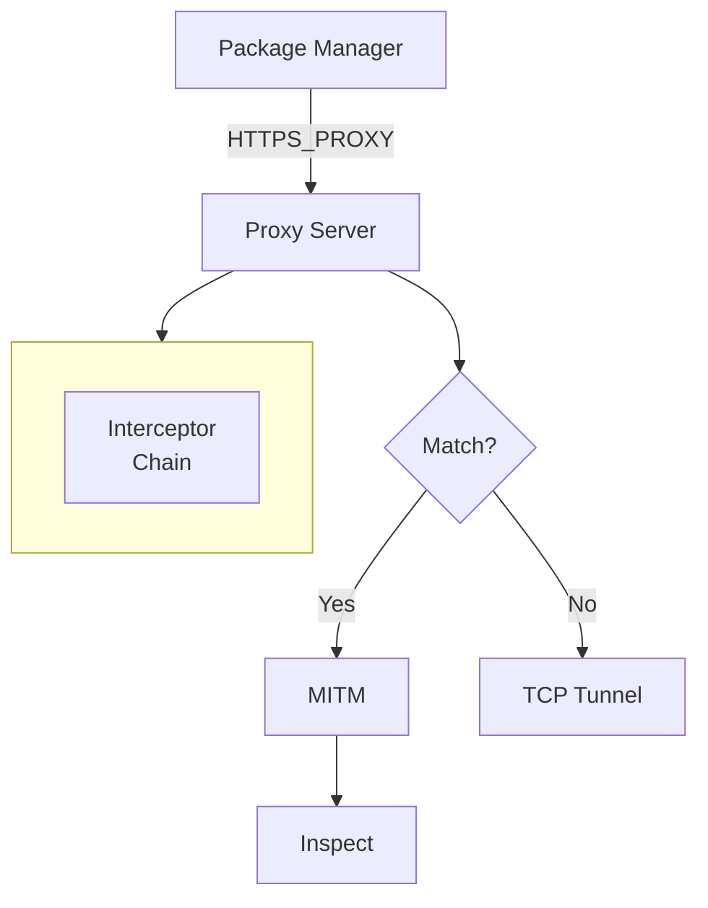

# PMG Proxy

A generic, extensible HTTP/HTTPS proxy server with man-in-the-middle (MITM) capabilities for intercepting and analyzing package manager traffic. 
Built with [goproxy](https://github.com/elazarl/goproxy) library.

## Features

- Selective interception of HTTPS traffic
- Pluggable interceptors for different use cases
- Certificate generation and management for HTTPS interception (MITM)

## Architecture



## Example

See [examples/proxy](../examples/proxy/README.md) for a complete example.

## Quick Start

```go
package main

import (
    "github.com/safedep/pmg/proxy"
    "github.com/safedep/pmg/proxy/certmanager"
)

func main() {
    // Generate CA certificate
    caCert, _ := certmanager.GenerateCA(certmanager.DefaultCertManagerConfig())

    // Create certificate manager
    certMgr, _ := certmanager.NewCertificateManagerWithCA(caCert, certmanager.DefaultCertManagerConfig())

    // Create proxy
    proxyServer, _ := proxy.NewProxyServer(&proxy.ProxyConfig{
        ListenAddr:   "127.0.0.1:8888",
        CertManager:  certMgr,
        EnableMITM:   true,
        Interceptors: []proxy.Interceptor{NewMyInterceptor()},
    })

    // Start proxy
    proxyServer.Start()

    // ... wait for shutdown signal ...

    proxyServer.Stop(context.Background())
}
```

## Certificate Manager

The `certmanager` package provides certificate generation and caching.

### Usage

```go
import "github.com/safedep/pmg/proxy/certmanager"

// Generate a new CA certificate
config := certmanager.DefaultCertManagerConfig()
caCert, err := certmanager.GenerateCA(config)

// Handle persistence (example)
os.WriteFile("ca-cert.pem", caCert.Certificate, 0644)

// Create certificate manager with CA
certMgr, err := certmanager.NewCertificateManagerWithCA(caCert, config)

// Generate host certificates (automatically cached)
hostCert, err := certMgr.GenerateCertForHost("registry.npmjs.org")
```

