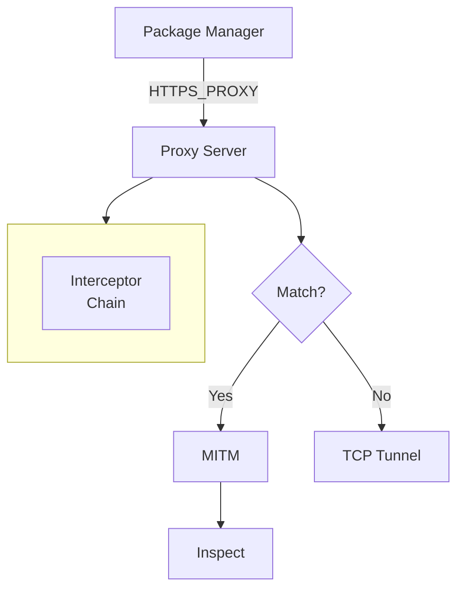

# PMG Proxy

A generic, extensible HTTP/HTTPS proxy server with man-in-the-middle (MITM) capabilities for intercepting and analyzing package manager traffic. 
Built with [goproxy](https://github.com/elazarl/goproxy) library.

## Configuration

Proxy behavior is configured under the `proxy:` section in `config.yml`:

```yaml
proxy:
  enabled: true
  install_only: false
  policies:
    npm:
      skip_commands: ["my-script"]
```

| Key | Default | Description |
|---|---|---|
| `enabled` | `true` | Enable proxy-based interception. When `false`, PMG falls back to guard-based analysis. |
| `install_only` | `false` | When `true`, only install commands are proxied. Other commands (e.g., `npm ls`, `pip list`) bypass the proxy and execute directly. |
| `policies` | `{}` | Per-package-manager policies. Each entry maps a package manager name to a policy with `skip_commands`. |

### Per-package-manager skip commands

The `policies` section lets you define additional commands that should bypass the proxy for specific package managers:

```yaml
proxy:
  policies:
    npm:
      skip_commands: ["dev", "my-script"]
    pip:
      skip_commands: ["list", "show"]
```

Commands in `skip_commands` are matched against the first non-flag argument. For example, `npm dev` would match `dev`, but `npm install dev` would not since `install` is the first non-flag argument.

### CLI flags

| Flag | Description |
|---|---|
| `--proxy-mode` | Override `proxy.enabled` |

### Environment variables

| Variable | Description |
|---|---|
| `PMG_PROXY_ENABLED` | Override `proxy.enabled` |
| `PMG_PROXY_INSTALL_ONLY` | Override `proxy.install_only` |

Legacy variables `PMG_PROXY_MODE` and `PMG_PROXY_INSTALL_ONLY` (for the old flat config keys) are still supported when the `proxy:` section does not exist in the config file.

## Features

- Selective interception of HTTPS traffic
- Pluggable interceptors for different use cases
- Certificate generation and management for HTTPS interception (MITM)

## Architecture


```mermaid
flowchart TD
    A[Package Manager]
    A -- HTTPS_PROXY --> B[Proxy Server]
    B --> C{Match?}
    C -- Yes --> D[MITM]
    D --> E[Inspect]
    C -- No --> F[TCP Tunnel]
    subgraph inside_proxy [ ]
        G[Interceptor<br/>Chain]
    end
    B --> inside_proxy
```

## Example

See [examples/proxy](../examples/proxy/README.md) for a complete example.

## Quick Start

```go
package main

import (
    "github.com/safedep/pmg/proxy"
    "github.com/safedep/pmg/proxy/certmanager"
)

func main() {
    // Generate CA certificate
    caCert, _ := certmanager.GenerateCA(certmanager.DefaultCertManagerConfig())

    // Create certificate manager
    certMgr, _ := certmanager.NewCertificateManagerWithCA(caCert, certmanager.DefaultCertManagerConfig())

    // Create proxy
    proxyServer, _ := proxy.NewProxyServer(&proxy.ProxyConfig{
        ListenAddr:   "127.0.0.1:8888",
        CertManager:  certMgr,
        EnableMITM:   true,
        Interceptors: []proxy.Interceptor{NewMyInterceptor()},
    })

    // Start proxy
    proxyServer.Start()

    // ... wait for shutdown signal ...

    proxyServer.Stop(context.Background())
}
```

## Certificate Manager

The `certmanager` package provides certificate generation and caching.

### Usage

```go
import "github.com/safedep/pmg/proxy/certmanager"

// Generate a new CA certificate
config := certmanager.DefaultCertManagerConfig()
caCert, err := certmanager.GenerateCA(config)

// Handle persistence (example)
os.WriteFile("ca-cert.pem", caCert.Certificate, 0644)

// Create certificate manager with CA
certMgr, err := certmanager.NewCertificateManagerWithCA(caCert, config)

// Generate host certificates (automatically cached)
hostCert, err := certMgr.GenerateCertForHost("registry.npmjs.org")
```

